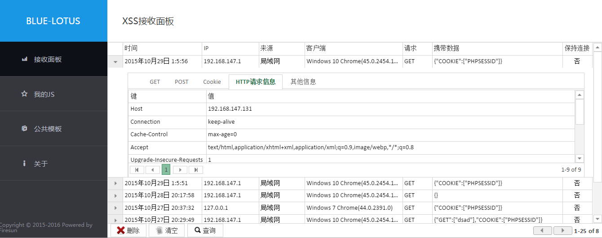
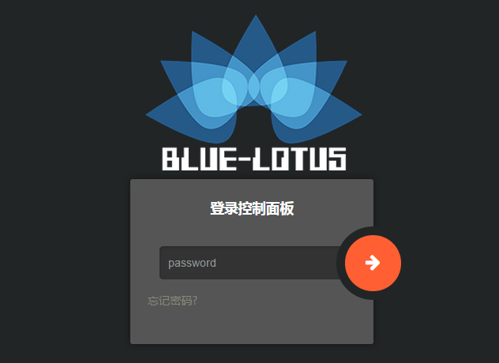
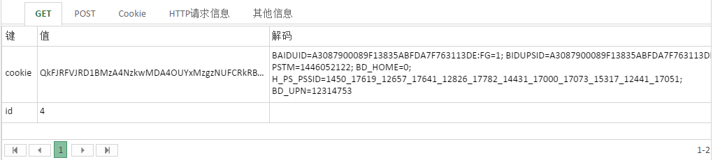
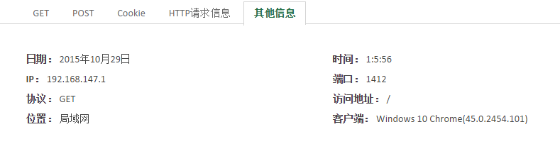
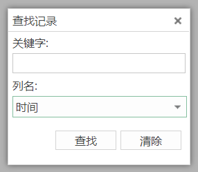
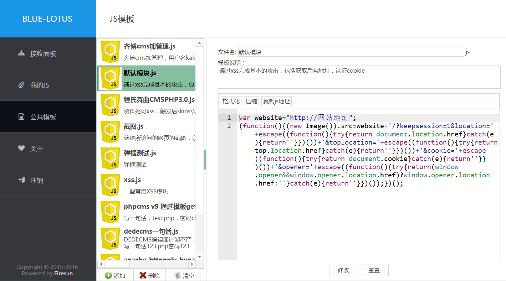
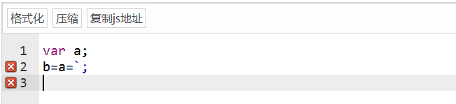
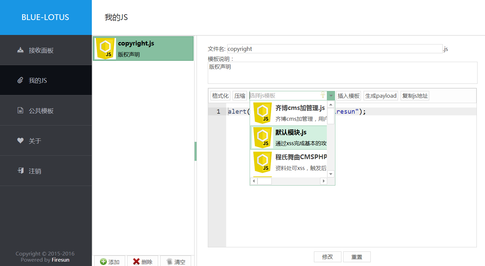
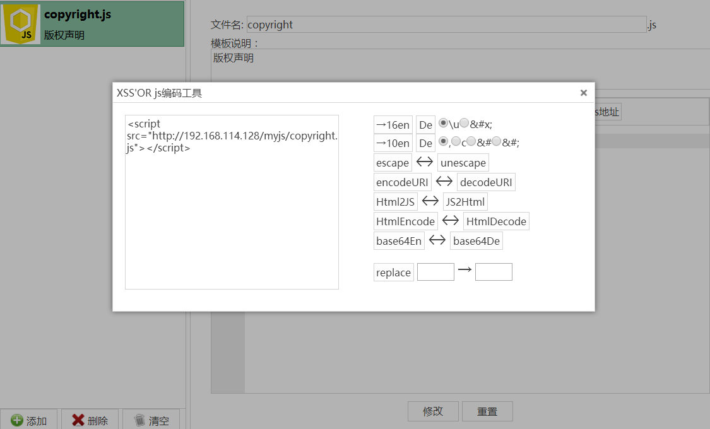

# XSS数据接收平台（无SQL版）
### 已更新3.0版，旧版本升级务必先阅读Readme
## 使用说明
本平台设计理念: 简单配置即可使用，无需数据库，无需其他组件支持，可直接在php虚拟空间使用


##使用步骤
1. 上传所有文件至空间根目录
2. 修改config.php配置文件，指定xss数据、我的js、js模板的存放目录，以及数据是否启用加密、加密密码、与加密方法（详细说明见config.php）
```php
define('PASS', '2a05218c7aa0a6dbd370985d984627b8');
define('DATA_PATH', 'data');
define('JS_TEMPLATE_PATH', 'template');
define('MY_JS_PATH', 'myjs');
define('ENABLE_ENCRYPT', true);
define('ENCRYPT_PASS', "bluelotus");
define('ENCRYPT_TYPE', "RC4");
```
3. PASS为登录密码，可用`php -r "$salt='!KTMdg#^^I6Z!deIVR#SgpAI6qTN7oVl';$key='你的密码';$key=md5($salt.$key.$salt);$key=md5($salt.$key.$salt);$key=md5($salt.$key.$salt);echo $key;"`生成密码hash
4. 赋予`DATA_PATH`，`MY_JS_PATH`，`JS_TEMPLATE_PATH`对应的目录写权限
5. 当有请求访问/index.php?a=xxx&b=xxxx，所有携带数据包括get，post，cookie，httpheaders，客户端信息都会记录
6. 可访问login.php登录查看记录的数据，初始登录密码bluelotus
7. 如果有权限，请开启Apache中的AllowOverride以使.htaccess生效（可选）



## 目前支持功能
* 自动判断携带数据是否base64编码，可自动解码



* 记录所有可记录的数据，并可根据ip判断位置，根据useragent判断操作系统与浏览器



* 新消息提醒，仿QQ邮箱新消息提醒框，可实时获得数据


* 支持简单的查找功能



* 除了style允许unsafe-inline外启用CSP
* 挑战应答式的登录校验，session绑定ip与useragent
* 密码输错五次封IP，误封请删除`DATA_PATH`/forbiddenIPList.dat文件
* 可以通过平台直接维护用于xss的js文件（详细说明见下）

## js公用模板模块



* 用户可添加一些js通用模板，在我的js里可随时插入js模板
* 采用ace编辑器，支持js语法高亮，语法错误检查



* 使用js_beautify实现js代码格式化，可随时格式化js代码
* 使用jsmin实现js代码压缩，可随时压缩js代码
* 支持复制js代码的url到剪切板（需要浏览器支持flash）
* 提供了一些常用的js模板，包括前几天心血来潮研究的用js截图

## 我的js模块



* 用户可随时插入js模板
* 部分整合[xssor](https://github.com/evilcos/xssor)功能，方便生成payload



## keepsession功能
* 需要在config.php开启
* 如果请求的get或post或cookie中带有keepsession=1，则这条记录会被keepsession
* 请设置脚本或者网站监控定期访问keepsession.php
* 请将cookie存在cookie参数，url存在location参数（传递方法可get可post可cookie），如`index.php?keepsession=1&cookie=aaa&location=bbb`,keepsession.php将会定期使用cookie aaa去访问bbb
* cookie和location参数支持base64编码，keepsession.php会自动判断，自动解码
* 如果不设置location，将会使用HTTP Referer作为url
* keepsession.php使用`flock($pid, LOCK_EX|LOCK_NB)`实现单例运行（由于windows下不支持无阻塞锁定，所以最好删除keepsession.php里的`set_time_limit(0)`），可自行加上sleep防止keepsession.php被恶意频繁访问

## 旧版本升级至3.0
* 本平台对xss记录、ip封禁列表、js的说明（仅说明）加密，用户可设置是否加密，密码以及加密方式（AES、RC4）
* 3.0版本起配置里的默认加密方式改为RC4（为了效率）
* 如果需要改密码，改加密方式，需要对xss记录、ip封禁列表、js的说明进行重加密才能正常访问这些数据

* 故根目录下提供了change_encrypt_pass.php用于重新加密xss记录,js的描述,ip封禁列表
* 请在修改加密方式或者加密密码后执行此文件（如果选择不加密,加密密码写任意值）
* **使用前，请将change_encrypt_pass.php开始的exit()注释掉，并且务必做好备份**
* 用法：在shell下执行
`php change_encrypt_pass.php (以前是否加密true/false) (旧加密密码) (旧加密方法AES/RC4) (现在是否加密) (新加密密码) (新加密方法)`

* 例:

	`php change_encrypt_pass.php true bluelotus AES true bluelotus RC4`
	`php change_encrypt_pass.php true bluelotus AES false xxxx(任意值) AES`
 
 
* 也可执行
`php change_encrypt_pass.php update (以前是否加密true/false) (旧加密密码)`

* 此命令可将所有xss记录转化为加密开启，密码bluelotus，加密方法RC4

***

1. 升级方案1：删除所有js模板（JS_TEMPLATE_PATH，MY_JS_PATH下的.js .desc文件），修改config.php直接使用原加密密码，加密方式ENCRYPT_TYPE改为AES，原xss记录可照常访问
2. 升级方案2：全新安装，舍弃原xss记录
3. 升级方案3：
	1. 首先执行
`php change_encrypt_pass.php update (以前是否加密true/false) (旧加密密码)`
 	2. 修改config.php，修改是否加密，新密码，加密方式
 	3. 执行`php change_encrypt_pass.php true bluelotus rc4 (现在是否加密) (新加密密码) (新加密方法)`
	4. 升级完成

## TODO
* 邮件提醒
* 短信提醒
* 多用户（SQL版本）
* WebSocket方式通知

## 特别说明
* 前端使用[Bootstrap](http://getbootstrap.com/)与[jQWidgets](http://www.jqwidgets.com/)开发，（原来用kendo UI，受限于商业许可，改用jQWidgets），`you can use jQWidgets for free under the Creative Commons Attribution-NonCommercial 3.0 License`, 但是不可用于商业用途，如需用于商业用途请购买授权
* 为实现jqxgrid不支持的功能，如固定表格高度实现row高度自动调节，修改了jQWidgets部分代码，具体修改部分可查看diff文件夹
* 为方便开发与调试，未合并压缩js与css，待最终版发布后合并
* 使用纯真ip库的函数基于Discuz X3.1 function_misc.php上修改而来, 判断客户端操作系统与浏览器的脚本基于原作者@author  Jea杨写的php版本修改而来，后台整体布局借鉴Kendo UI 的demo NORTHWIND DASH
* js代码格式化使用[js_beautify](https://github.com/beautify-web/js-beautify)库
* js代码压缩采用jsmin.js
* js代码编辑器采用[ace](https://ace.c9.io)
* **Warning: 本工具仅允许使用在CTF比赛等学习、研究场景，严禁用于非法用途**

## 意见与建议

欢迎大家在使用过程中提出各种宝贵的意见和建议，以及各种bug，不胜感激

反馈邮箱firesun.cn`at`gmail.com
